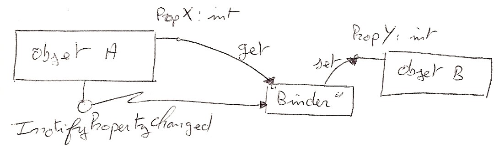
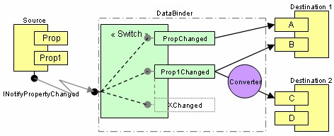

**Project Description**

un moteur de binding permettant de binder deux objets métier ensemble, en utilisant les méthodes dynamiques (LCG).

le but de ce projet est de proposer un alternative au binding traditionnelle (utilisant massivement la reflection), en utilisant une partie du framork .Net assez méconnue, le LCG (Lightweight Code Generation). Ce projet est conçu avec le Framework .Net 2.0, et pour [silverlight](silverlight).

l'architecture globale est la suivante :

Le mode de fonctionnement de ce moteur de binding 

Le binding peut être "hiérarchique", c'est à dire que par exemple "Prop" peut être spécifié à la mode WPF, "XXX.YYY.ZZZ" et ainsi référencer des objets sous jacents.

voici l'article complet associé à ce projet : [creer_son_binding.pdf](Home_creer_son_binding.pdf)

Maj 12/05/2008 une version pour [silverlight](silverlight) est disponible 
